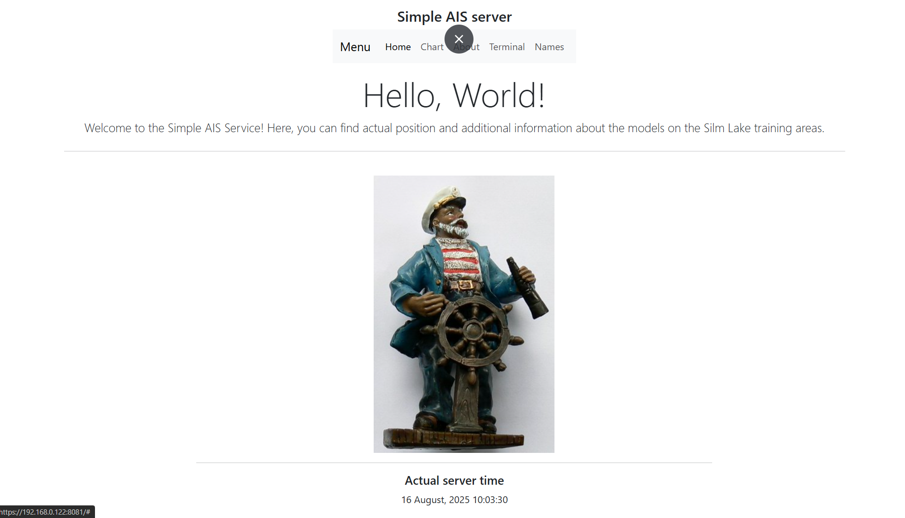
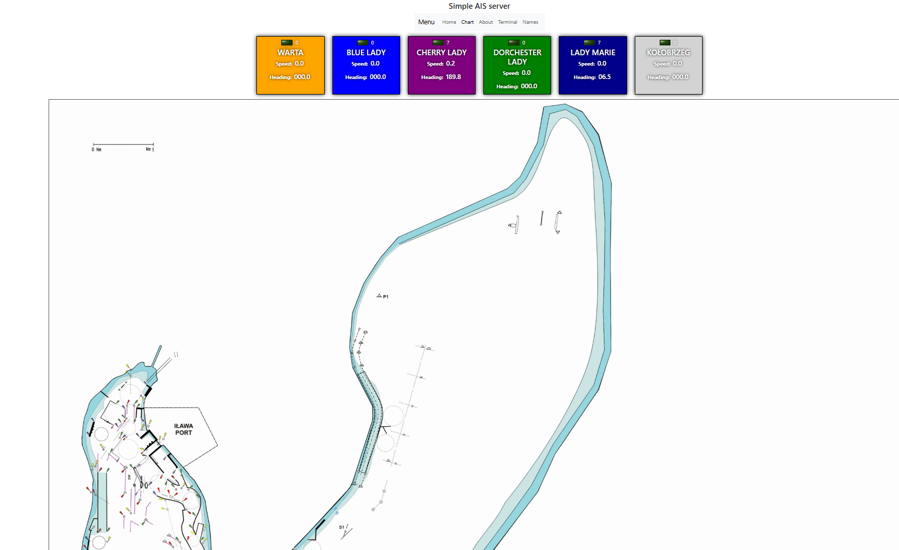
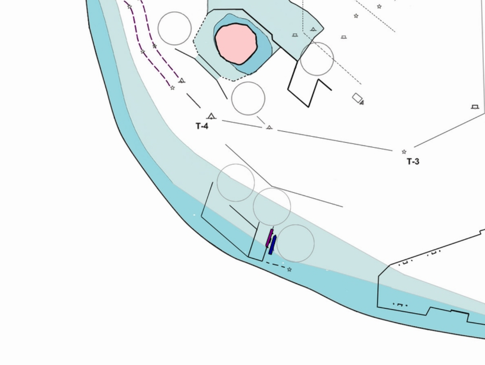

Uruchomienie aplikacji z plikiem *.jar<br>
```./start_docker.sh```<br>
lub <br>
```./start_docker.sh -d ``` odpali aplikację "w tle"
---------
Koniec wiadomości w transmisji szeregowej traktowany jest przez pojawienie się znaków ustawianych w propercie
```rs.message_delimiter=13,10```. Taka wiadomośc powinna pojawić się w logach konsoli, powinna zostać zapisana w plikach logów oraz powinna pojawić się na stronie WWW po otrzymaniu danych.

W przeglądarce wchodzimy na adres: <br>
https://localhost:8081/ <br>





