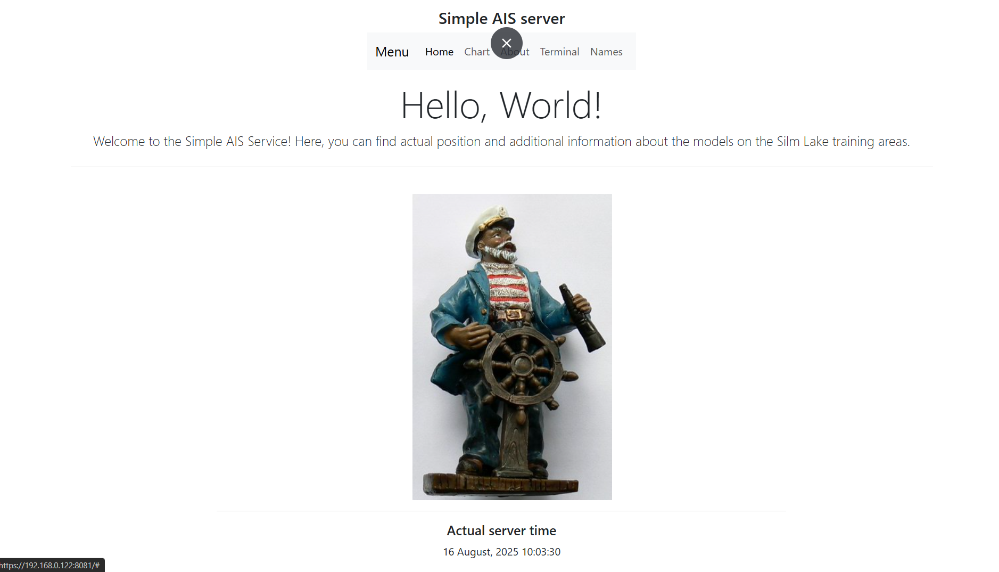
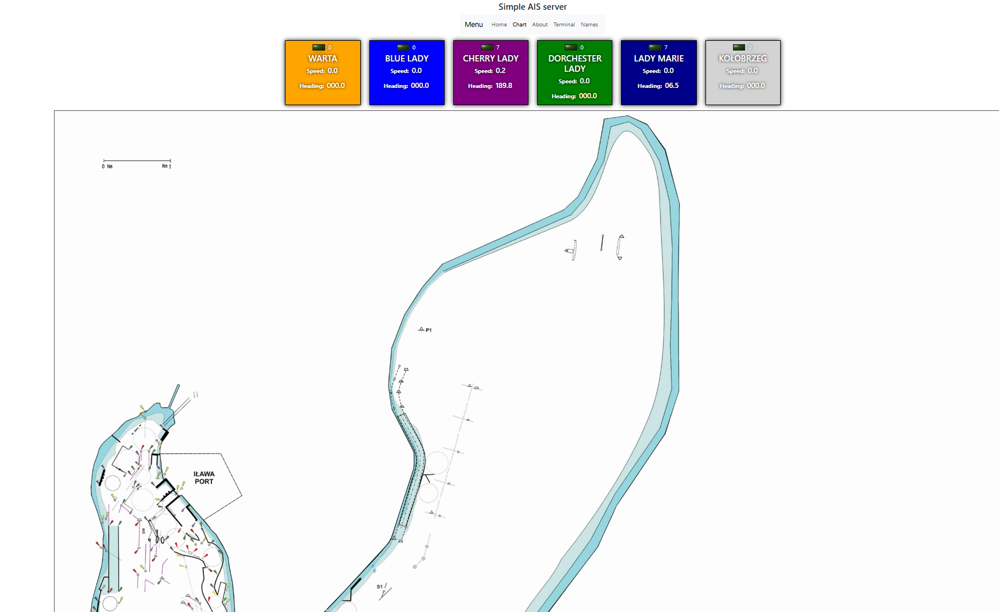
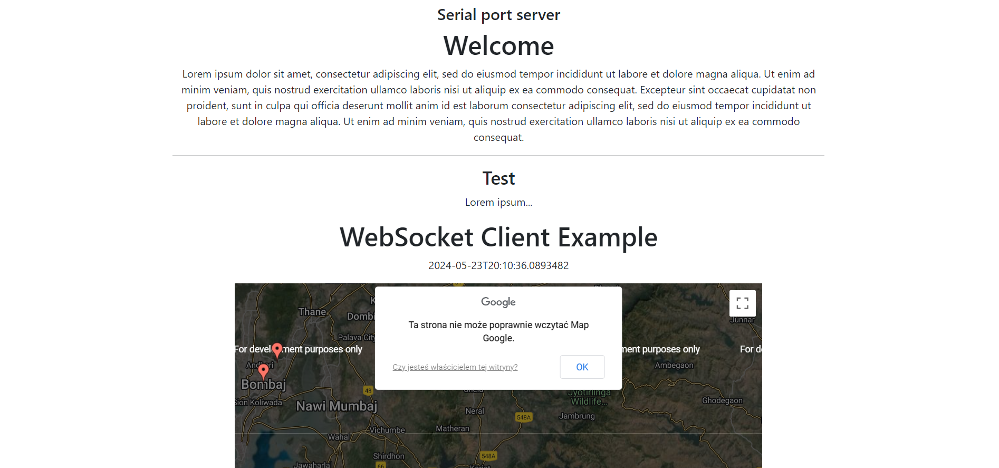

# Serial Protocol – Simple AIS

Aplikacja Spring Boot (Java 21) do odbioru i wizualizacji danych AIS z portów szeregowych (RS-232) w czasie rzeczywistym przez WebSocket.

## Wymagania

- Java 21+
- Maven 3.9+ (lub wrapper `mvnw` / `mvnw.cmd`)
- MariaDB 11.7 (lub Docker)

## Szybki start

### Docker (zalecane)

```bash
./start_docker.sh        # uruchomienie w pierwszym planie
./start_docker.sh -d     # uruchomienie w tle
./stop_docker.sh         # zatrzymanie
```

Docker Compose podnosi dwa kontenery:
- **serial-ports-server** – aplikacja (port `8081` → `443` wewnątrz kontenera)
- **mariadb** – baza danych MariaDB 11.7

### Lokalnie z Maven

```bash
.\mvnw.cmd spring-boot:run
```

### Z pliku JAR

```bash
.\mvnw.cmd clean package -Dmaven.test.skip=true
java -jar .\target\serial-protocol-1.9.jar
```

Aplikacja nasłuchuje na porcie **443** (HTTPS, SSL/PKCS12).
W przeglądarce: `https://localhost:8081/` (przez Docker) lub `https://localhost:443/` (lokalnie).

## Budowanie i testy

| Polecenie | Opis |
|---|---|
| `.\mvnw.cmd clean test` | Pełny zestaw testów |
| `.\mvnw.cmd -Dtest=MapControllerTest test` | Pojedyncza klasa testowa |
| `.\mvnw.cmd -Dtest=MapControllerTest#test_IndexEndpoint test` | Pojedyncza metoda testowa |
| `.\mvnw.cmd clean package` | Budowa JAR z testami |
| `.\mvnw.cmd clean package -Dmaven.test.skip=true` | Budowa JAR bez testów |

## Konfiguracja transmisji szeregowej

Koniec wiadomości w transmisji szeregowej jest rozpoznawany przez pojawienie się znaków ustawianych we właściwości:
```
rs.message_delimiter=13,10
```
Taka wiadomość pojawia się w logach konsoli, zostaje zapisana w plikach logów oraz wyświetlona na stronie WWW w czasie rzeczywistym.

## Architektura

### Pipeline odbioru danych
`SerialController` → `SerialPortListenerImpl` → `MessageTranslator` → WebSocket (`/rs`, `/json`)

### Kanały WebSocket
| Kanał | Opis |
|---|---|
| `/rs` | Surowe dane z portu szeregowego |
| `/json` | Przetłumaczone dane jako JSON (`ModelTrackDTO`) |
| `/heartbeat` | Sygnał heartbeat |
| `/session` | Licznik aktywnych sesji |

### Modele statków
| Model | ID |
|---|---|
| WARTA | 1 |
| BLUE_LADY | 2 |
| DORCHERTER_LADY | 3 |
| CHERRY_LADY | 4 |
| KOLOBRZEG | 5 |
| LADY_MARIE | 6 |

### Generowanie raportów PDF
Aplikacja umożliwia generowanie raportów PDF z danych kursów (`PdfReportController` → `PdfReportService`). Konfiguracja czcionek i limitów w `application.properties` (prefiks `pdf.report.*`).

### Bezpieczeństwo
Uwierzytelnianie in-memory z konfiguracją przez właściwości (`custom.server.credentials.*`). Chronione ścieżki: `/name-service`, `/instructor-service`, `/api/**`, `/admin/**`, `/db-utils/**`, `/pdf/**`, oraz wszystkie endpointy CRUD domeny custom (`/trainer-service/**`, `/lecturer-service/**`, `/technician-service/**`, `/participant-service/**`, `/courses-service/**`, `/course-type-service/**`, `/course-counter-service/**`).

## Dokumentacja szczegółowa

Katalog [`docs/`](docs/) zawiera dodatkowe materiały opisujące implementację i środowisko:

| Dokument | Opis |
|---|---|
| [`custom-domain-analysis.md`](docs/custom-domain-analysis.md) | Pełna analiza domenowa modułu `custom` – hierarchia encji (`PersonBase`, `Lecturer`, `Trainer`, `Technician`, `Participant`, `Courses`, `CourseType`, `CourseCounter`, `Image`), mapowanie DTO, szablony Thymeleaf, lista naprawionych bugów i ostrzeżeń |
| [`pdf-report-plan.md`](docs/pdf-report-plan.md) | Plan implementacji raportów PDF – porównanie bibliotek (OpenPDF, iText, PDFBox, Openhtmltopdf), architektura rozwiązania, API endpointów `/pdf/**`, layout i kolorystyka raportów |
| [`Opis RS232.txt`](docs/Opis%20RS232.txt) | Przykładowe logi z transmisji szeregowej – format ramek, odkrywanie portów na Linux (Futro 720) i Windows 10, zdarzenia `serialEvent` |
| [`js.navigator.userAgent.txt`](docs/js.navigator.userAgent.txt) | Referencja User-Agent dla testowanych urządzeń i przeglądarek (Chrome, Edge, Safari, Samsung Internet na Windows, Android, iPhone, iPad) |

Dodatkowo w `docs/` znajdują się zrzuty ekranu interfejsu aplikacji (`img.png`, `img_1.png`, `img_2.png`, `img_3.png`).

## Zrzuty ekranu





