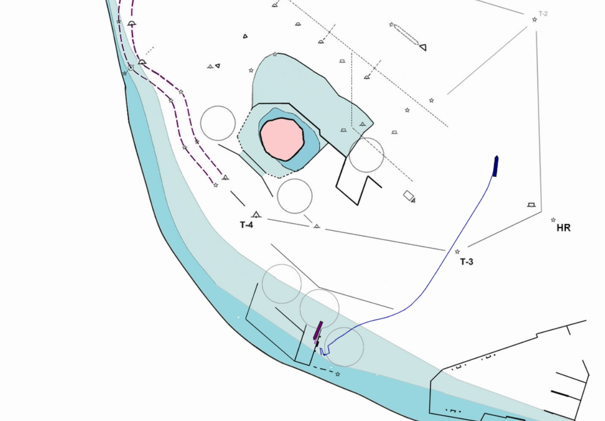

Zapisanie obrazu do pliku </br>
```docker save -o sps.tgz serial-protocol-server```

Importowanie obrazu z pliku do repozytorium lokalnego Dockera</br>
```docker import sps.tgz```
----------
Uruchomienie aplikacji z plikiem *.jar<br>
```docker compose build```<br>
```docker compose up```<br>
lub <br>
```docker compose up -d ``` odpali aplikacji "w tle"
---------
Koniec wiadomości w transmisji szeregowej traktowany jest przez pojawienie się znaków ustawianych w propercie
```rs.message_delimiter=13,10```. Taka wiadomośc powinna pojawić się w logach konsoli, powinna zostać zapisana w plikach logów oraz powinna pojawić się na stronie WWW po otrzymaniu danych.

W przeglądarce wchodzimy na adres: <br>
http://localhost:8080/ <br>

Na stronie będzie aktualizał się Timestamp <br>
``` 2024-05-23T20:13:03.133683``` co wartość w [ms] ustawioną w propercie 
```ws.heartbeat.interval=2000``` <br>
Przykładowy widok<br>
